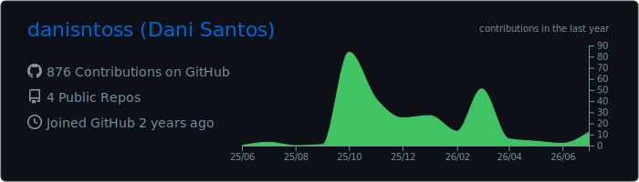
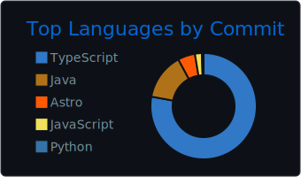
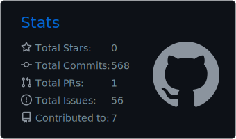
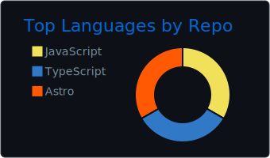
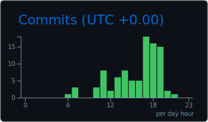

### Daniel Santos
`software engineer` · Madrid, España

> Recién graduado en Ing. de Software por la URJC. Ahora backend en **MAPFRE** (Spring Boot, PL/SQL, MongoDB) y proyectos personales en React + TypeScript.

---

#### Now

- 💼 IT Intern en **MAPFRE** — backend del proyecto REEF Vida + automatización interna
- 🎓 Graduado en **Ing. de Software** por la URJC (Madrid, 2022 — 2026 · nota media 8,1)
- 🕹️ **[AlgoArcade](https://alg0arcade.vercel.app)** publicado — TFG: plataforma para aprender algoritmia con minijuegos (Canvas API + Firebase)

#### Focus

`Full-stack web` · `AI tooling` · `ESP32 & hardware`

#### Stack

---

#### GitHub

---

#### Elsewhere

[Portfolio](https://danisantos.vercel.app) · [santos-studio.es](https://santos-studio.es) · [LinkedIn](https://linkedin.com/in/danisntoss) · [dani@santos-studio.es](mailto:dani@santos-studio.es)
